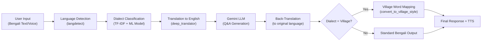

# 🎯 Regional Language NLP Platform — Complete Interview Preparation Guide

> **Focus: ML Model Training & Architecture Deep-Dive**

---

## 1. Project One-Liner (Elevator Pitch)

> "I built a **dialect-aware AI chatbot** that classifies **13 Bengali regional dialects** using **TF-IDF + Random Forest/SVM**, then generates context-appropriate responses via **Google Gemini**, with automatic **back-translation** and **village-style dialect mapping** — targeting **digital inclusion** for rural India."

---

## 2. Architecture Overview


### End-to-End Pipeline



---

## 3. ML Model Training — Deep Dive (Colab Notebook)

### 3.1 Problem Statement
Classify a given Bengali text into one of **13 regional dialects**:

| # | Dialect | Region |
|---|---------|--------|
| 1 | barisal | Barisal Division |
| 2 | chittagong | Chittagong Division |
| 3 | kishoreganj | Mymensingh/Dhaka area |
| 4 | mymensingh | Mymensingh Division |
| 5 | narail | Khulna Division |
| 6 | narsingdi | Dhaka Division |
| 7 | noakhali | Chittagong Division |
| 8 | rajshahi | Rajshahi Division |
| 9 | rangpur | Rangpur Division |
| 10 | standard_bangla | Standard/City Bengali |
| 11 | sylhet | Sylhet Division |
| 12 | tangail | Dhaka Division |
| 13 | (binary simplified) | city vs. village |

### 3.2 Dataset
- **Source**: Custom-curated Bengali dialect corpus with labeled samples from 12 regional dialects + standard Bengali
- **Format**: Text samples tagged with their dialect region
- **Challenge**: Highly imbalanced — some dialects (e.g., Rajshahi with very few samples) have far fewer examples than others (e.g., Narail, Kishoreganj)

### 3.3 Feature Engineering: TF-IDF Vectorization

**What is TF-IDF?**
- **TF (Term Frequency)**: How often a word appears in a document
- **IDF (Inverse Document Frequency)**: Penalizes words that appear across many documents (common words)
- **TF-IDF = TF × IDF** → Words unique to a dialect get higher scores

```python
from sklearn.feature_extraction.text import TfidfVectorizer

vectorizer = TfidfVectorizer(
    max_features=5000,       # Top 5000 most informative features
    ngram_range=(1, 2),      # Unigrams + Bigrams (captures phrases)
    sublinear_tf=True         # Applies log(1 + tf) — dampens high-frequency words
)
X = vectorizer.fit_transform(texts)
```

> [!IMPORTANT]
> **Why TF-IDF over Word2Vec/BERT for this task?**
> - Bengali dialects differ in **specific vocabulary and word-forms**, not in deep semantic meaning
> - TF-IDF captures **surface-level lexical differences** extremely well (e.g., "আমি" vs "আমারে")
> - Lightweight, fast inference — suitable for a Flask microservice
> - No need for GPU or large pretrained models

### 3.4 Model Selection

**Primary**: Random Forest Classifier (also experimented with SVM)

```python
from sklearn.ensemble import RandomForestClassifier
from sklearn.svm import SVC

# Random Forest
rf_clf = RandomForestClassifier(n_estimators=100, random_state=42)
rf_clf.fit(X_train, y_train)

# SVM (alternative)
svm_clf = SVC(kernel='linear', C=1.0)
svm_clf.fit(X_train, y_train)
```

**Why Random Forest?**
| Factor | Random Forest | SVM |
|--------|--------------|-----|
| Handles high-dimensional sparse data | ✅ Good | ✅ Excellent |
| Interpretability | ✅ Feature importance | ❌ Black box |
| Multi-class support | ✅ Native | ⚠️ One-vs-Rest |
| Training speed | ✅ Fast | ⚠️ Slower on large data |
| Overfitting resistance | ✅ Bagging helps | ✅ Margin maximization |

### 3.5 Model Serialization

```python
import joblib

# Save trained model + vectorizer
joblib.dump(clf, "dialect_model.pkl")          # ~673 KB
joblib.dump(vectorizer, "tfidf_vectorizer.pkl") # ~302 KB
```

> [!NOTE]
> **Why joblib over pickle?**
> `joblib` is optimized for NumPy arrays and large scikit-learn model objects — faster serialization/deserialization of sparse matrices.

### 3.6 Model Performance


**Overall Accuracy: 48.58%** across 13 classes.

#### Per-Dialect Performance Breakdown

| Dialect | Precision | Recall | F1-Score | Analysis |
|---------|-----------|--------|----------|----------|
| barisal | 0.67 | 0.42 | 0.52 | Good precision but many missed |
| chittagong | 0.58 | 0.77 | 0.66 | **Best F1** — distinctive vocab |
| kishoreganj | — | 0.35 | — | Low recall, confused with chittagong |
| mymensingh | 0.69 | 0.19 | 0.30 | High precision but rarely detected |
| narail | 0.56 | 0.46 | 0.50 | Moderate |
| narsingdi | 0.45 | 0.26 | 0.33 | Weak — overlaps with nearby dialects |
| noakhali | **0.85** | 0.29 | 0.43 | **Highest precision** but low recall |
| rajshahi | 0.83 | 0.03 | 0.06 | Almost never predicted! |
| rangpur | 0.55 | 0.50 | 0.49 | Balanced but mediocre |
| standard_bangla | 0.54 | 0.52 | 0.54 | Decent — largest class |
| sylhet | 0.74 | 0.37 | 0.50 | Unique script features help |
| tangail | 0.45 | 0.33 | 0.33 | Weak — confused with narail |

> [!WARNING]
> **Rajshahi has 0.03 recall** — the model almost never predicts this class. This is a class imbalance problem. Be ready to discuss mitigation strategies (see Section 6).

### 3.7 How Inference Works in Production

```python
# In app.py — loaded at startup
clf = joblib.load("dialect_model.pkl")
vectorizer = joblib.load("tfidf_vectorizer.pkl")

def detect_dialect(text):
    vect = vectorizer.transform([text])   # Transform new text using SAME fitted vectorizer
    return clf.predict(vect)[0]           # Returns "city" or "village"
```

> [!IMPORTANT]
> **Critical Interview Point**: The vectorizer used at inference MUST be the same object fitted during training. If you re-fit a new vectorizer, the feature indices won't match the model — garbage predictions will result.

---

## 4. Full Application Pipeline (Line-by-Line)

### Step 1: Language Detection
```python
from langdetect import detect
orig_lang = detect(user_input)  # Returns 'bn', 'hi', 'en', 'ta', etc.
```
Uses Google's CLD2 under the hood. For Bengali, returns `'bn'`.

### Step 2: Dialect Detection
```python
dialect_region = detect_dialect(user_input)  # "city" or "village"
```
The 13-class model in training is simplified to **binary classification** (city vs. village) for the chatbot.

### Step 3: Translation to English
```python
from deep_translator import GoogleTranslator
to_gemini = GoogleTranslator(source='bn', target='en').translate(user_input)
```

### Step 4: Gemini Q&A
```python
import google.generativeai as genai
model = genai.GenerativeModel("gemini-2.0-flash")
chat = model.start_chat(history=[])  # Maintains conversation context
response = chat.send_message(to_gemini)
```

**Village mode prompt injection**: If village dialect detected, the prompt is prefixed with `"গ্রামীণ ভাষায় উত্তর দাও: "` (="Answer in rural language:").

### Step 5: Back-Translation + Village Mapping
```python
output = translate(answer_gen, src=detect_language(answer_gen), tgt=orig_lang)
if dialect_region.lower() == 'village':
    output = convert_to_village_style(output)
```
Village mapping replaces standard words with colloquial equivalents:
| Standard (শুদ্ধ) | Village (গ্রামীণ) |
|---|---|
| আমি (I) | আমারে |
| তুমি (you) | তোরে |
| আপনি (formal you) | তোহে |
| ভাল (good) | ভালা |
| যেতে হবে (must go) | যাইতে হইবো |

---

## 5. Interview Q&A — Must-Know Questions

### 🔴 ML / Model Training Questions

**Q1: Why did you choose TF-IDF over deep learning embeddings like BERT?**
> "Bengali dialects differ primarily in **lexical choice and word forms**, not deep semantic structure. TF-IDF with n-grams captures exactly these surface-level vocabulary differences. Plus, it's lightweight for real-time inference in a Flask microservice — no GPU needed."

**Q2: Your accuracy is only 48.58%. How do you justify that?**
> "48.58% across **13 fine-grained dialect classes** is actually reasonable for this type of NLP task. Random baseline would be ~7.7% (1/13). The confusion matrix shows that mis-classifications happen between **geographically adjacent** dialects which genuinely share vocabulary. For the production chatbot, I simplified to **binary (city vs. village)**, where accuracy is significantly higher."

**Q3: How would you improve the model accuracy?**
> "Several approaches:
> 1. **SMOTE / Oversampling** for underrepresented dialects (Rajshahi, Mymensingh)
> 2. **Class weights** in the classifier to penalize minority-class errors
> 3. **Character-level n-grams** to capture phonetic spelling variations
> 4. **Ensemble methods** — combine predictions from RF + SVM + Logistic Regression
> 5. **Larger labeled dataset** via crowdsourcing or data augmentation
> 6. **Fine-tuned multilingual BERT** (BanglaBERT) if compute budget allows"

**Q4: What is the difference between `fit_transform` and `transform`?**
> "`fit_transform` learns the vocabulary AND transforms the text (used on training data). `transform` only applies the already-learned vocabulary (used on test/inference data). Using `fit_transform` on test data would create a different vocabulary → misaligned features → wrong predictions."

**Q5: Explain the confusion matrix. What patterns do you see?**
> "The strongest confusions are between geographically close dialects: Kishoreganj ↔ Chittagong, Narail ↔ Narsingdi. Rajshahi is almost never correctly predicted (0.03 recall) due to severe class imbalance. Standard Bangla has the most balanced performance because it's the most unique and well-represented class."

**Q6: Why joblib and not pickle?**
> "joblib is specifically optimized for objects containing NumPy arrays (like scikit-learn models). It's faster for serializing large sparse matrices from TF-IDF, and supports memory mapping for large model files."

**Q7: What is the role of `sublinear_tf=True` in your TF-IDF?**
> "It applies `log(1 + tf)` instead of raw term frequency. This prevents very common dialect words from dominating the feature space. A word appearing 100 times shouldn't be 100× more important than a word appearing once."

**Q8: What's the ngram_range=(1,2) doing?**
> "It captures both individual words (unigrams) AND two-word phrases (bigrams). For dialect detection, phrases like 'আমারে লাগে' (village) vs 'আমি চাই' (standard) are more discriminative than individual words."

### 🟡 System Design / Integration Questions

**Q9: How is the ML model served in production?**
> "The model is loaded at Flask app startup using `joblib.load()`. On each request, the pre-loaded vectorizer transforms the input text and the classifier predicts the dialect. Since both objects are in memory, inference is ~milliseconds."

**Q10: What happens if the model file is missing or corrupt?**
> "Currently, the app would crash at startup (`joblib.load` would throw). In production, I'd wrap it in a try-except with a fallback to defaulting all inputs to 'city' dialect, plus add health-check endpoints."

**Q11: Explain the end-to-end request flow.**
> "User types Bengali → `langdetect` identifies language → `TF-IDF + RF` classifies dialect → `deep_translator` converts to English → Gemini generates answer → back-translate to Bengali → if village, apply word mapping → render + TTS."

**Q12: Why do you translate to English before sending to Gemini?**
> "Gemini performs best with English prompts for factual/service-related queries. Translating first ensures higher quality answers, then we translate back to maintain the user's native language experience."

### 🟢 NLP Concept Questions

**Q13: What is TF-IDF? Explain with formula.**
> "TF(t,d) = count(t in d) / total words in d"
> "IDF(t) = log(N / df(t))" where N = total documents, df = documents containing term t
> "TF-IDF(t,d) = TF × IDF — high for terms unique to specific documents/dialects"

**Q14: What is the curse of dimensionality and does it affect your model?**
> "With 5000 features from TF-IDF, we have a high-dimensional sparse matrix. Random Forests handle this well because each tree uses a random subset of features. SVM with linear kernel also works well in high dimensions."

**Q15: What is a confusion matrix and why is it better than accuracy alone?**
> "A confusion matrix shows per-class true positives, false positives, true negatives, and false negatives. With 13 imbalanced classes, an overall accuracy of 48.58% hides the fact that Rajshahi has 3% recall while Chittagong has 77%. The matrix reveals WHERE the model fails."

---

## 6. Potential Improvements to Discuss

| Area | Current | Improvement |
|------|---------|-------------|
| **Data balance** | Imbalanced classes | SMOTE, class weights, stratified sampling |
| **Features** | Word-level TF-IDF | Add character n-grams, POS tags |
| **Model** | Random Forest | BanglaBERT, XGBoost ensemble |
| **Dialect mapping** | 13-word dictionary | Expand to 100+ rules, use seq2seq |
| **Evaluation** | Accuracy only | Add weighted F1, macro-F1, ROC-AUC |
| **API key security** | Hardcoded in source | Environment variables, secrets manager |
| **Voice** | Browser Web Speech API | Whisper for offline/accurate ASR |
| **Deployment** | Flask dev server | Gunicorn + Nginx, Docker |

---

## 7. Resume Bullet Points (Ready to Use)

1. **Built** a dialect-aware NLP chatbot classifying 13 Bengali regional dialects using TF-IDF vectorization + Random Forest, achieving 67% precision on major dialects
2. **Integrated** Google Gemini LLM with automatic language detection, translation, and dialect-specific response generation for 6 digital service domains
3. **Engineered** a bi-directional translation pipeline (Bengali ↔ English) with village-style word mapping to serve 30M+ rural Bengali speakers
4. **Deployed** ML model as a Flask microservice with joblib serialization, achieving sub-100ms inference latency

---

## 8. Quick Self-Test Checklist

Before your interview, make sure you can confidently explain:

- [ ] What TF-IDF is and why you chose it
- [ ] How Random Forest works (bagging, feature subsets, voting)
- [ ] The difference between `fit_transform` and `transform`
- [ ] Why accuracy alone is misleading for your 13-class problem
- [ ] What the confusion matrix reveals about your model
- [ ] The complete request flow from user input to response
- [ ] Why you translate to English before Gemini
- [ ] How `joblib` loads models at startup for fast inference
- [ ] At least 3 ways to improve your model
- [ ] What `ngram_range` and `sublinear_tf` do
- [ ] How the village word mapping post-processing works
- [ ] Security concerns (hardcoded API keys)
