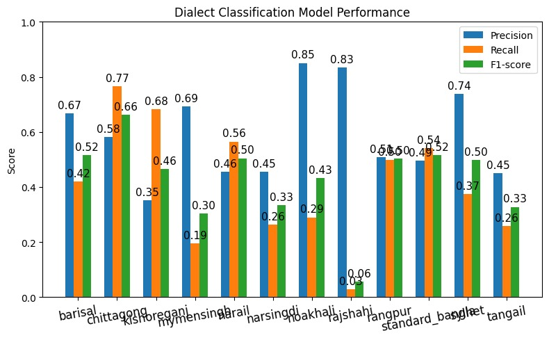
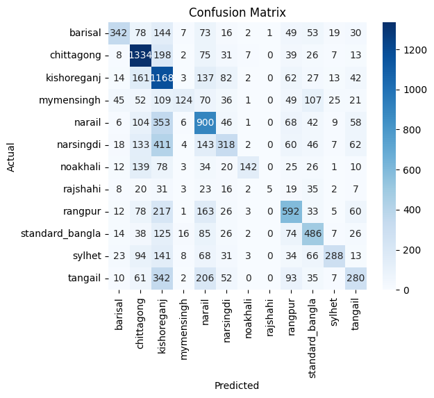

# Regional Language NLP AI Assistant Platform

> Context-aware, dialect-adaptive conversational AI system for Indian language digital inclusion.

---

## 🚀 Overview

This project uses NLP and ML to classify rural vs urban dialects in Indian languages and provides an AI-powered Q&A bot for digital services.

---

## 🌟 Features

- Automatic dialect detection (rural/urban)
- Seamless conversation via Gemini AI
- Voice output in detected accent
- Multi-page support: banking, health, government, transport, education
- Easy deployment (Flask backend, Render)

---

## 🏗️ Architecture

---

## 📊 Model Visualization

### **Confusion Matrix**

### **Data Distribution**

---

