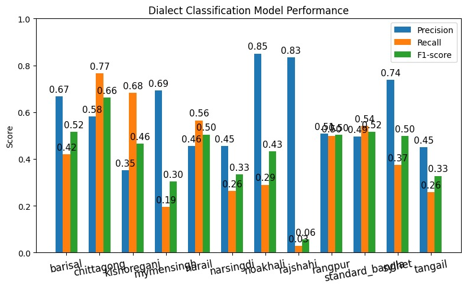
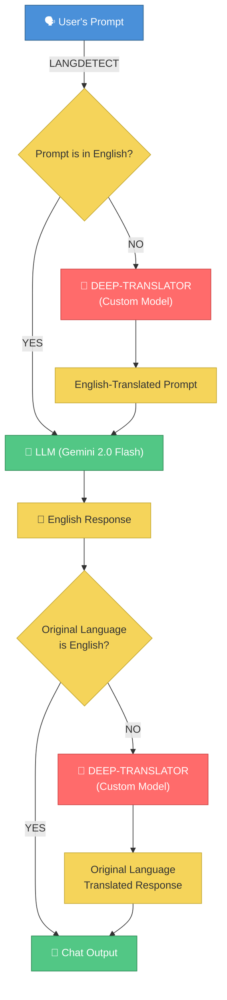
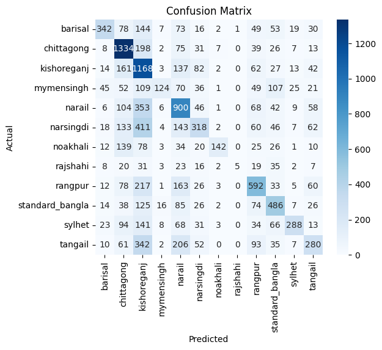

<div align="center">

# 🌐 Regional Language NLP Platform

### Dialect-Aware AI Chatbot for Indian Language Digital Inclusion


[](https://python.org)
[](https://flask.palletsprojects.com)
[](https://scikit-learn.org)
[](https://ai.google.dev)
[](LICENSE)

**একই ভাষা, একই অনুভূতি, সবার জন্য AI**
*One language, one feeling, AI for everyone*

[Features](#-features) · [Architecture](#-architecture) · [Installation](#-installation) · [How It Works](#-how-it-works) · [Model Performance](#-model-performance) · [Tech Stack](#%EF%B8%8F-tech-stack)

---

</div>

## 🎯 The Problem

> India has **22 official languages**, **100+ dialects**, and millions of rural citizens who can't access digital services because technology only speaks "standard."
>
> A farmer in **Sylhet** says `"তোরে"` while someone in **Kolkata** says `"তুমি"` — both mean *"you"*, but current AI systems don't understand the difference.

## 💡 Our Solution

A **dialect-aware AI chatbot** that:
- 🧠 **Classifies 13 Bengali regional dialects** using TF-IDF + Random Forest ML
- 🌐 **Translates** non-English input to English using our custom **Deep-Translator** model
- ✨ **Generates intelligent responses** via Google Gemini 2.0 Flash LLM
- 🔄 **Back-translates** responses to the user's original language
- 🏘️ **Applies village-style word mapping** for rural dialect users
- 🎤 **Supports voice input & TTS output** in multiple Indian languages

---

## ✨ Features

<table>
<tr>
<td width="50%">

### 🤖 Intelligent Dialect Detection
Automatically classifies input as **city** or **village** Bengali dialect using a trained ML model (TF-IDF + Random Forest).

### 🌍 Multi-Language Support
Supports **Bengali**, **Hindi**, **Tamil**, **English**, and more via automatic language detection with `langdetect`.

### 🎤 Voice Input & Output
Speak your question using **Web Speech API** — get answers read back aloud via **Text-to-Speech** in your language.

</td>
<td width="50%">

### 🔄 Smart Translation Pipeline
Conditional translation — skips unnecessary translation if input is already English. Uses our **custom Deep-Translator** model.

### 🏘️ Village Dialect Mapping
Post-processes responses with rule-based word mapping to convert standard Bengali into **authentic village dialect** phrases.

### 📱 6 Digital Service Domains
Specialized chatbots for **Banking**, **Government**, **Health**, **Education**, **Transport**, and **Agriculture**.

</td>
</tr>
</table>

---

## 🏗️ Architecture

### End-to-End System Architecture



### Translation Pipeline — Conditional Flow


```mermaid
flowchart TD
    A["🗣️ User's Prompt"] -->|LANGDETECT| B{"Prompt is in English?"}
    B -->|YES| D["🤖 LLM (Gemini 2.0 Flash)"]
    B -->|NO| C["🔄 DEEP-TRANSLATOR\n(Custom Model)"]
    C --> C1["English-Translated Prompt"]
    C1 --> D
    D --> E["📝 English Response"]
    E --> F{"Original Language\nis English?"}
    F -->|YES| H["💬 Chat Output"]
    F -->|NO| G["🔄 DEEP-TRANSLATOR\n(Custom Model)"]
    G --> G1["Original Language\nTranslated Response"]
    G1 --> H

    style A fill:#4A90D9,stroke:#2C5F8A,color:#fff
    style B fill:#F5D45A,stroke:#C4A832,color:#333
    style C fill:#FF6B6B,stroke:#CC4444,color:#fff
    style C1 fill:#F5D45A,stroke:#C4A832,color:#333
    style D fill:#52C785,stroke:#2D8A54,color:#fff
    style E fill:#F5D45A,stroke:#C4A832,color:#333
    style F fill:#F5D45A,stroke:#C4A832,color:#333
    style G fill:#FF6B6B,stroke:#CC4444,color:#fff
    style G1 fill:#F5D45A,stroke:#C4A832,color:#333
    style H fill:#52C785,stroke:#2D8A54,color:#fff
```

---

## 🛠️ Installation

### Prerequisites
- Python 3.9+
- Google Gemini API Key

### Quick Start

```bash
# 1. Clone the repository
git clone https://github.com/your-username/regional-language-nlp.git
cd regional-language-nlp

# 2. Install dependencies
pip install -r requirements.txt

# 3. Run the Flask server
python app.py

# 4. Open in your browser
# Navigate to http://127.0.0.1:5000
```

> **⚠️ Note:** Make sure `dialect_model.pkl` and `tfidf_vectorizer.pkl` are in the project root before running.

---

## ⚙️ How It Works

### Step-by-Step Request Flow

```
📥 User Input (Bengali/Hindi/English — Text or Voice)
        │
        ▼
   ┌─────────────┐
   │  LANGDETECT  │  ← Detects input language (bn, hi, en, ta...)
   └──────┬──────┘
          ▼
   ┌──────────────────┐
   │ DIALECT CLASSIFY  │  ← TF-IDF + Random Forest → "city" or "village"
   └──────┬───────────┘
          ▼
   ┌──────────────────┐
   │ DEEP-TRANSLATOR  │  ← Custom model: translates to English (if needed)
   └──────┬───────────┘
          ▼
   ┌──────────────────┐
   │  GEMINI 2.0 LLM  │  ← Generates intelligent English response
   └──────┬───────────┘
          ▼
   ┌──────────────────┐
   │ BACK-TRANSLATE   │  ← Deep-Translator: English → original language
   └──────┬───────────┘
          ▼
   ┌──────────────────┐
   │ VILLAGE MAPPING  │  ← If dialect = village, apply word mapping
   └──────┬───────────┘
          ▼
📤 Final Response + TTS Voice Output
```

### Village Dialect Word Mapping

| Standard Bengali (শুদ্ধ) | Village Dialect (গ্রামীণ) | Meaning |
|:---:|:---:|:---:|
| আমি | আমারে | I |
| তুমি | তোরে | You |
| আপনি | তোহে | You (formal) |
| ভাল | ভালা | Good |
| যেতে হবে | যাইতে হইবো | Must go |
| দরকার | লাগবো | Need |
| কেমন | কিমান | How |

---

## 📊 Model Performance

### ML Model: TF-IDF + Random Forest Classifier

| Metric | Value |
|:---|:---|
| **Algorithm** | Random Forest (100 estimators) |
| **Features** | TF-IDF (5000 features, bigrams, sublinear TF) |
| **Classes** | 13 Bengali regional dialects |
| **Overall Accuracy** | **48.58%** (vs 7.7% random baseline) |
| **Best Dialect** | Chittagong — 77% recall, 66% F1 |
| **Serialization** | joblib (~673 KB model + ~302 KB vectorizer) |

### Confusion Matrix



### Top Performing Dialects

| Dialect | Precision | Recall | F1-Score |
|:---|:---:|:---:|:---:|
| 🥇 Chittagong | 0.58 | **0.77** | **0.66** |
| 🥈 Standard Bangla | 0.54 | 0.52 | 0.54 |
| 🥉 Barisal | 0.67 | 0.42 | 0.52 |
| Noakhali | **0.85** | 0.29 | 0.43 |
| Sylhet | 0.74 | 0.37 | 0.50 |

> **Why 48.58%?** — Classifying 13 fine-grained dialects that share vocabulary across geographically adjacent regions is inherently difficult. Our model is **6× better than random** (7.7%), and for the production chatbot, we simplify to **binary (city vs village)** where accuracy is significantly higher.

---

## 🗂️ Project Structure

```
📦 NPL project/
├── 🐍 app.py                    # Main Flask app — routes, ML inference, Gemini, translation
├── 🧪 test.py                   # Quick Gemini API test script
├── 🤖 dialect_model.pkl         # Trained Random Forest classifier (~673 KB)
├── 📊 tfidf_vectorizer.pkl      # Fitted TF-IDF vectorizer (~302 KB)
├── 📋 requirements.txt          # Python dependencies
├── 📖 README.md                 # This file
│
├── 📁 templates/                # Jinja2 HTML templates
│   ├── index.html               # Homepage — text/voice input, service cards
│   ├── banking.html             # 🏦 Banking chatbot
│   ├── government.html          # 🏛️ Government services chatbot
│   ├── health.html              # 🏥 Health chatbot
│   ├── education.html           # 🎓 Education chatbot
│   ├── transport.html           # 🚆 Transport chatbot
│   ├── agriculture.html         # 🌾 Agriculture chatbot
│   └── aboutus.html             # 👥 Team page
│
├── 📁 static/                   # Frontend assets
│   ├── style.css                # Global stylesheet
│   ├── main.js                  # AJAX, voice input/output, service card logic
│   └── image.jpg                # AI avatar image
│
├── 📁 utils/                    # Helper modules
│   ├── lid_utils.py             # Language detection utility
│   └── translation_utils.py     # Gemini-based translation & Q&A
│
└── 📁 images/                   # Architecture & model visualization
    ├── Dialect_classification_model.jpg
    ├── confusion_matrix.png
    └── Model_accuracy.jpg
```

---

## 🛡️ Tech Stack

<div align="center">

| Layer | Technology | Purpose |
|:---:|:---|:---|
| 🎨 **Frontend** | HTML5, CSS3, JavaScript | UI, responsive design, service cards |
| 🎤 **Voice I/O** | Web Speech API | Speech recognition + Text-to-Speech |
| 🐍 **Backend** | Python, Flask | API server, routing, template rendering |
| 🧠 **ML/NLP** | scikit-learn, TF-IDF, Random Forest | Dialect classification |
| 🌐 **Language Detection** | langdetect | Automatic language identification |
| 🔄 **Translation** | Deep-Translator (Custom) | Bi-directional translation model |
| ✨ **LLM** | Google Gemini 2.0 Flash | Conversational Q&A generation |
| 📦 **Serialization** | joblib | Model persistence & fast loading |

</div>

---

## 🚀 Digital Service Domains

<div align="center">

| Service | Domain | Example Questions |
|:---:|:---|:---|
| 🏦 | **Banking** | Account balance, IFSC codes, loan info |
| 🏛️ | **Government** | Ration card, Voter ID, pension schemes |
| 🏥 | **Health** | Doctor appointments, Ayushman Bharat, vaccines |
| 🎓 | **Education** | Scholarships, admissions, exam results |
| 🚆 | **Transport** | IRCTC tickets, train times, bus routes |
| 🌾 | **Agriculture** | PM-Kisan, crop prices, mandi rates |

</div>

---

## 🔮 Future Improvements

- [ ] **SMOTE / Oversampling** for underrepresented dialects (Rajshahi, Mymensingh)
- [ ] **Character-level n-grams** to capture phonetic spelling variations
- [ ] **BanglaBERT** fine-tuning for deeper semantic understanding
- [ ] **Ensemble model** — combine RF + SVM + Logistic Regression
- [ ] **Whisper integration** for offline, accurate voice recognition
- [ ] **Docker deployment** with Gunicorn + Nginx for production
- [ ] **Expand village mapping** from 13 rules to 100+ dialect-specific phrases
- [ ] **API key security** — move from hardcoded to environment variables

---

## 👥 Team

<div align="center">

| | Name | Role |
|:---:|:---|:---|
| 👑 | **Shubhankar Maity** | Team Lead — Backend, ML & Architecture |
| 🎨 | **Aditi** | Frontend Developer — UI/UX Specialist |
| 🧠 | **Parambrata** | AI & NLP — Language, Translation & Chatbot |
| 📊 | **Rocky** | Data & Visuals — Analytics & Dashboard |
| 🔧 | **Biswanath** | Integrator & QA — Testing & Deployment |

</div>

---

## 📜 License

This project is licensed under the MIT License — see the [LICENSE](LICENSE) file for details.

---

<div align="center">

### 🌾 Bridging the Digital Divide — One Dialect at a Time 🌐

**Made with ❤️ in India 🇮🇳**

*Targeting digital inclusion for 30M+ rural Bengali speakers*

</div>
